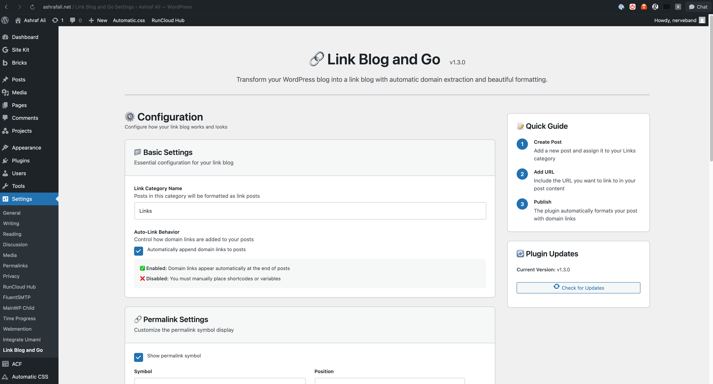

# Link Blog and Go

> ⚠️ **Beta Status**: This plugin is now in beta, with improved handling of post titles and link formatting.

Transform your WordPress blog into a link blog - easily share and comment on interesting links you find across the web.

Version: 1.1.0

## What is a Link Blog?

A link blog is a type of blog where posts primarily consist of interesting links you've found on the web, along with your commentary about why they're worth sharing. Think of it as curating the best of the web for your readers.



## Features

- 🔗 Automatically formats link posts with source attribution
- ⭐ Adds a distinctive permalink symbol to link posts (without modifying post titles)
- 📱 Clean, minimal design that works with any theme
- 📰 Optional RSS feed enhancements for link posts
- 🎯 Category-specific: Only affects posts in your designated links category
- ⚙️ Customizable settings:
  - Custom category name for link posts
  - Customizable permalink symbol and position
  - RSS feed modifications toggle

## How It Works

1. Create a new post in WordPress
2. Add it to your links category (default: "Links")
3. Write your post in this format:
   ```
   Title: Name of what you're linking to

   Your commentary about why this is interesting

   Include the URL you're linking to somewhere in your text

   Optional: Credit where you found the link with "via"
   ```

The plugin will automatically:
- Extract the first URL it finds in your post
- Add a source attribution at the bottom
- Add a permalink symbol for easy reference (in the post content, not the title)
- Style the post distinctively (while staying compatible with your theme)
- Only apply these changes to posts in your designated links category

## Installation

1. Download the plugin
2. Upload to your WordPress site's `/wp-content/plugins/` directory
3. Activate the plugin through the 'Plugins' menu in WordPress
4. Configure settings under Settings > Link Blog and Go

## Configuration

Access plugin settings under Settings > Link Blog and Go to customize:

- **Link Category Name**: Change the default "Links" category name
- **Permalink Symbol**: Change the default "★" symbol and its position
- **RSS Feed Modifications**: Toggle enhanced RSS feed formatting for link posts

## Key Features

### Category-Specific Processing
- Changes only apply to posts in your designated links category
- Other posts remain completely unaffected
- Easy to manage which posts get the link blog treatment

### Non-Destructive Formatting
- Preserves your original post titles
- Adds permalink symbols and formatting without modifying the database
- Easily reversible - disable the plugin to return to original formatting

## Development Status

This plugin is now in **beta** status with improved stability and handling of post formatting. Recent updates include:
- ✅ Non-destructive title handling
- ✅ Improved category-specific processing
- ✅ Enhanced customization options

## Contributing

This is a personal project in active development. Feel free to:

1. Fork the repo
2. Create a feature branch
3. Submit a pull request

## License

MIT License - see [LICENSE](LICENSE) for details.

## Author

Created by [Ashraf Ali](https://ashrafali.net)

---

*Note: This plugin is inspired by the classic link blog format popularized by sites like [Daring Fireball](https://daringfireball.net) and [Simon Willison's approach to link blogging](https://simonwillison.net/2024/Dec/22/link-blog/). Simon's article provides excellent insights into the value and practice of link blogging:*

> Sharing interesting links with commentary is a low effort, high value way to contribute to internet life at large.
> 
> — Simon Willison 